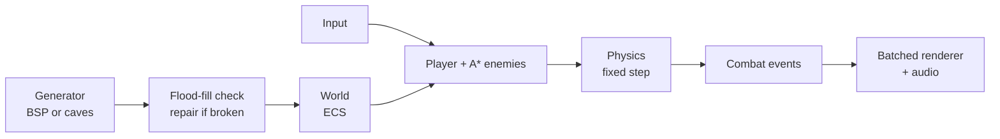

# Dungeon

> A 2D game engine I built from scratch in C++17, plus a procedurally generated dungeon crawler on top of it — every floor guaranteed solvable, with A* enemies and all art and sound generated in code.

**[Download for Windows](https://github.com/makkergauri/dungeon-engine/releases/latest)** · **[Source](https://github.com/makkergauri/dungeon-engine)**


---

## The problem

Random dungeons break in quiet ways: a room sealed off with no door, an exit you can't reach, enemies that walk into walls or clip through corners. The usual fix is to regenerate until something looks okay, which makes generation time unbounded and hides the bugs instead of fixing them. I wanted floors that are provably playable, and an engine clean enough that the game logic can be tested without opening a window.

## Approach

I split it into two layers. `engine/` is a small general-purpose 2D engine that knows nothing about dungeons; `game/` is built on top. Physics collides against the level through a one-method interface (`isSolid(x, y)`), so the engine never learns what a floor is.

Gameplay runs on a fixed 60 Hz timestep, separate from rendering, so movement and collision behave identically on any machine and a seeded run replays exactly.



The key decisions:

- **Repair, don't retry.** After generating, I flood-fill from the entrance. If any floor tile is unreachable, I carve a tunnel to it instead of throwing the map away. Generation stays bounded and a bad seed stays reproducible.
- **A\* kept off the hot path.** Enemies only search when a wall blocks line of sight, repath on a staggered timer, and are capped at 4 searches per step.
- **ECS over inheritance.** Entities are IDs, behaviour comes from which components they own. That's what lets the tests build a physics world in three lines.

## Results

| What | Result | How it's measured |
|---|---|---|
| Floors fully connected | 240 / 240 seeds | Flood fill from entrance on 120 BSP + 120 cave floors (`test_generation.cpp`) |
| Exit reachable by A* | 120 / 120 seeds | A* from entrance to exit, both generators, 60 seeds each |
| A* path optimality | Exact | Path cost matches hand-computed octile distance (e.g. 5 diagonal steps = 5√2) |
| Wall tunnelling | 0 | Body at 4000 px/s for 120 physics steps never ends inside a wall tile |
| Test suite | 29 cases, 44,682 assertions | Catch2, all passing on GCC 13 and MSVC 19.44 |

**How to reproduce:** build (below), then run `./build/Release/dungeon_tests` (Windows) or `cd build && ctest`.

**Limitations:** these check correctness, not performance. Entity-vs-entity collision is O(n²), fine at the ~40 entities per floor here but it would need a spatial hash past a few hundred. The generated art and audio are functional placeholders, not the work of an artist. Full list in [design-decisions.md](docs/design-decisions.md).

## Tech stack

C++17, SFML 2.6 (window, rendering, audio), CMake, Catch2 for tests. No other libraries — the ECS, pathfinding, generation, physics and asset synthesis are all written from scratch.

## Running it

**Just want to play?** Grab the zip from [Releases](https://github.com/makkergauri/dungeon-engine/releases/latest), unzip, run `dungeon.exe`. If it complains about `MSVCP140.dll`, install the [Microsoft Visual C++ Redistributable](https://aka.ms/vs/17/release/vc_redist.x64.exe).

**Building from source** needs a C++17 compiler, CMake 3.16+, and **SFML 2.6.x** — not 3, the API changed. vcpkg now ships SFML 3, so use the official binaries from sfml-dev.org.

```bash
git clone https://github.com/makkergauri/dungeon-engine.git
cd dungeon-engine
cmake -S . -B build -DCMAKE_BUILD_TYPE=Release
cmake --build build --config Release
```

On Windows, add `"-DCMAKE_PREFIX_PATH=C:/SFML-2.6.2"` to the first cmake line and copy SFML's DLLs next to `dungeon.exe`.

**Controls:** WASD move · Space attack · E stairs / merchant · Esc pause · **H how to play** · F1 performance overlay. Clear eight floors to win.

## My role

Solo project — designed and built independently.
